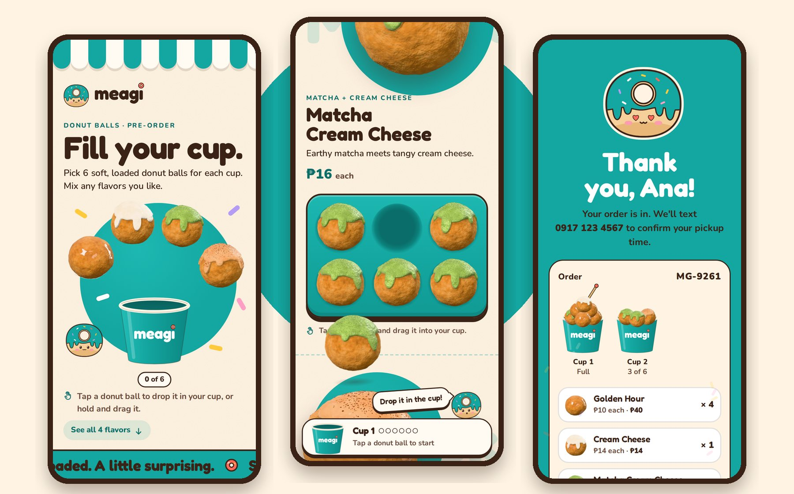

# Meagi · Donut Ball Stall

A mobile-first order page prototype for Meagi donut balls. Customers "pick up" donut balls from the stall trays, drop them into a paper cup (6 per cup), then leave their name and mobile number to place a pre-order.

**This is a prototype.** Prices are samples, the donut images are 3D-rendered placeholders, and the form doesn't send orders anywhere yet.

## How it works

- **Tap** a donut ball and it flies into your cup.
- Or **press and hold** a donut ball, then **drag** it into the cup (on a computer, just drag it).
- Each cup holds 6. When a cup is full, a skewer pops in and a fresh cup slides in.
- Tap **Checkout**, check your cups (tap a ball to take it out, or use − and +), enter your name and mobile number, then tap **Place my order**.

The flavors: **Golden Hour** (classic glazed), **Cream Cheese**, **Matcha Cream Cheese** and **Pumpkin Spice Cream Cheese**.

## Put it on GitHub (about 2 minutes)

1. Go to [github.com/new](https://github.com/new). Name the repository `meagi-order-page-proto`, choose **Public**, and click **Create repository**. Don't add a README.
2. On the next page, click the **uploading an existing file** link.
3. Unzip `meagi-order-page-proto.zip` and open the folder. Select everything inside it (`index.html`, `app.js`, `styles.css`, `README.md`, `CLAUDE.md` and the `assets` folder) and drag it onto the GitHub page. Use Chrome or Edge, so the `assets` folder uploads with everything in it.
4. Click **Commit changes**.
5. Open **Settings → Pages**. Under **Build and deployment**, set **Source** to **Deploy from a branch**, choose **main** and **/ (root)**, then click **Save**.
6. Wait a minute and refresh the page. Your link appears at the top of the Pages settings. It will look like `https://<your-username>.github.io/meagi-order-page-proto/`.

A free GitHub account can only publish public repositories as a website. The files hold no personal information.

## Change things

| What | Where |
|---|---|
| Prices, flavor names, descriptions | `index.html`, in the block with `id="menu-data"` near the top |
| Donut images | `assets/balls/` (keep the same file names, see below) |
| Colors and fonts | `styles.css`, in the list at the top |

**Donut images.** Each flavor has 3 images in 2 sizes, for example `glazed-1-640.webp` and `glazed-1-288.webp`. The flavor names in the files are `glazed` (Golden Hour), `cream`, `matcha` and `pumpkin`. Use square images with a transparent background and the donut ball centered, filling about 90% of the square.

The cup is designed for 6 donut balls, so keep `cupSize` at 6.

## Brand

Built with the Meagi Brand Kit v1.0: a cream base, Meagi Teal as the signature, chocolate text, and one coral pop per screen (the checkout button). Headlines use Fredoka; text and prices use Nunito, because Fredoka has no ₱ sign. Mea is the host, and Mea's eyes follow the donut balls so customers look at them too.

## Before going live

- Send orders somewhere (for example a Google Sheet) and show real pickup days and times.
- Swap in real photos and real prices.
- A parent or guardian should own the page and the order inbox.
